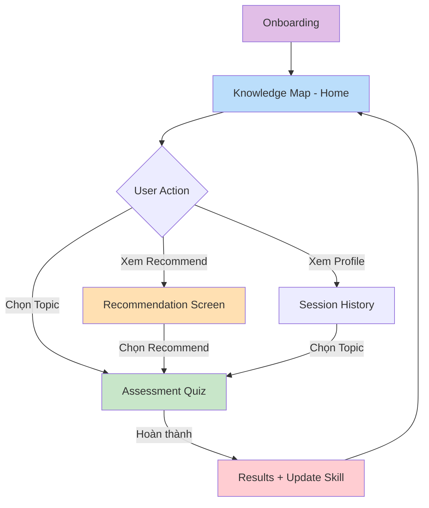
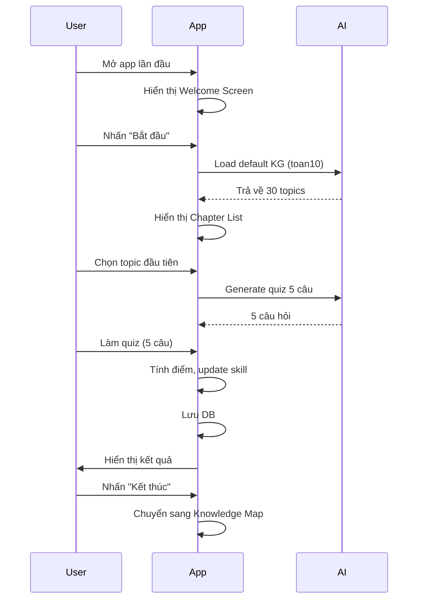
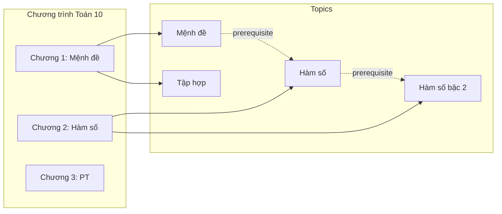
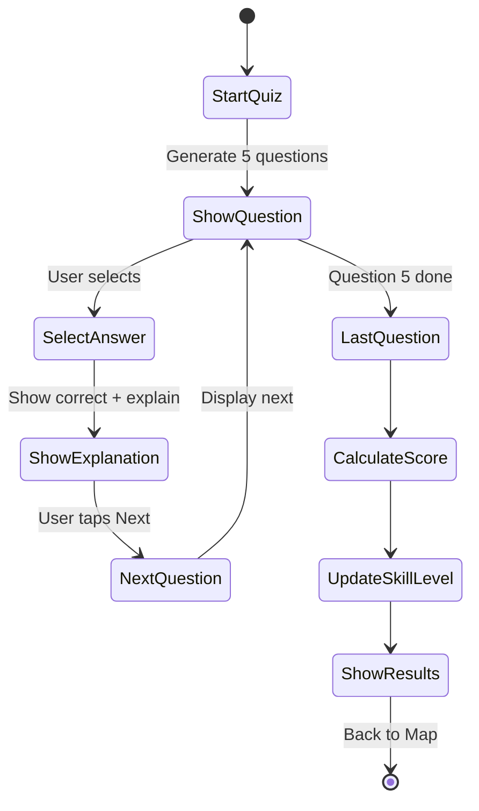
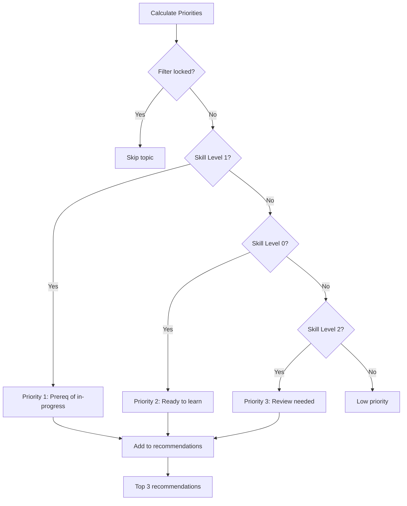
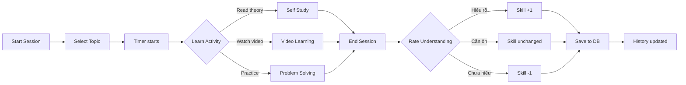
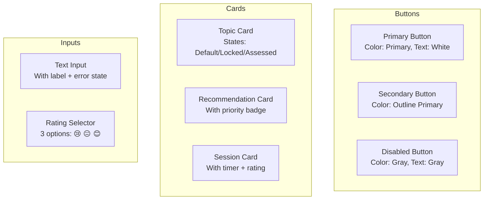
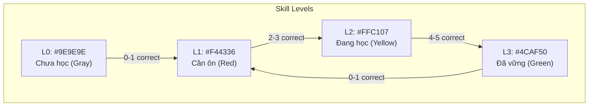
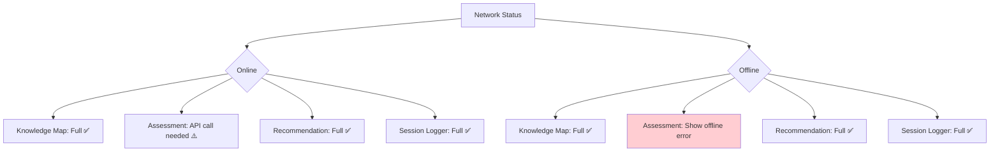

# Wireframes - KnowledgeMap Learning App

## Navigation Flow



---

## Screen 1: Onboarding



### Onboarding Screen Layout
```
┌─────────────────────────────────────┐
│                                     │
│         📚 KnowledgeMap             │
│                                     │
│    Chào mừng bạn đến với ứng dụng   │
│    học Toán lớp 10 cá nhân hóa      │
│                                     │
│    ┌─────────────────────────────┐  │
│    │  🎯 Mục tiêu của bạn:        │  │
│    │  • Xác định lỗ hổng KT      │  │
│    │  • Lộ trình học cá nhân      │  │
│    │  • Chuẩn bị kiểm tra         │  │
│    └─────────────────────────────┘  │
│                                     │
│    [     Bắt đầu ngay     ]         │
│                                     │
└─────────────────────────────────────┘

Time: ≤ 3 phút (NFR-09)
```

---

## Screen 2: Knowledge Map (Main Screen)



### Knowledge Map Grid Layout
```
┌─────────────────────────────────────┐
│ [≡] Knowledge Map - Toán 10    [🔔] │
├─────────────────────────────────────┤
│ [Tất cả ▼]  [Filter: L0 L1 L2 L3]   │
├─────────────────────────────────────┤
│ ▼ Chương 1: Mệnh đề - Tập hợp       │
│ ┌───────┐ ┌───────┐ ┌───────┐       │
│ │  L3   │ │  L2   │ │ 🔒 L0 │       │
│ │ Mệnh  │ │ Tập   │ │ Phép  │       │
│ │ đề    │ │ hợp   │ │ toán  │       │
│ └───────┘ └───────┘ └───────┘       │
│                                     │
│ ▼ Chương 2: Hàm số bậc nhất & bậc 2 │
│ ┌───────┐ ┌───────┐ ┌───────┐       │
│ │ 🔒 L0 │ │ 🔒 L0 │ │ 🔒 L1 │       │
│ │ Hàm   │ │ Đồ   │ │ GTNN  │       │
│ │ số    │ │ thị  │ │ GTLN  │       │
│ └───────┘ └───────┘ └───────┘       │
│                                     │
│ ▼ Chương 3: Phương trình            │
│ ┌───────┐ ┌───────┐                 │
│ │ 🔒 L0 │ │ 🔒 L0 │                 │
│ │ PT    │ │ Hệ PT │                 │
│ │ bậc 1 │ │       │                 │
│ └───────┘ └───────┘                 │
├─────────────────────────────────────┤
│ 📊 Hoàn thành: 2/30 topics (6.7%)   │
├─────────────────────────────────────┤
│ 💡 Gợi ý học tập:                   │
│   1. Hàm số bậc 2 (Đủ điều kiện)    │
│   2. Đồ thị hàm số (Tiền đề)        │
│   3. Bất phương trình (Cần ôn)      │
└─────────────────────────────────────┘

Legend:
L0 = Xám (Chưa học)
L1 = Đỏ (Cần ôn)
L2 = Vàng (Đang học)
L3 = Xanh (Đã vững)
🔒 = Locked (prereq < 2) - FR-07
```

### Topic Card Component
```
┌─────────────────┐
│  ┌───┐          │
│  │🔓 │ Name     │  ← Icon + Name
│  └───┘          │
│  L2 - Medium    │  ← Difficulty + Skill
│                 │
│  ✓ 80% đúng     │  ← Last score (if assessed)
└─────────────────┘

States:
- Default: Border primary
- Selected: Border accent + shadow
- Locked: Gray overlay + 🔒 icon
- Assessed: Show last score
```

---

## Screen 3: Assessment Quiz Flow



### Quiz Screen Layout
```
┌─────────────────────────────────────┐
│ [←] Phương trình bậc nhất    [1/5] │
├─────────────────────────────────────┤
│ Progress: ████████░░░░░░░░ 40%      │
├─────────────────────────────────────┤
│                                     │
│ Câu 1: Phương trình nào là PT bậc   │
│        nhất một ẩn?                  │
│                                     │
│ ┌─────────────────────────────┐     │
│ │ ○  A. ax² + bx + c = 0     │     │
│ └─────────────────────────────┘     │
│ ┌─────────────────────────────┐     │
│ │ ●  B. ax + b = 0      ✓    │ ← Selected
│ └─────────────────────────────┘     │
│ ┌─────────────────────────────┐     │
│ │ ○  C. x² + x + 1 = 0        │     │
│ └─────────────────────────────┘     │
│ ┌─────────────────────────────┐     │
│ │ ○  D. x + y = 0             │     │
│ └─────────────────────────────┘     │
│                                     │
├─────────────────────────────────────┤
│ ✅ Giải thích: PT bậc nhất có dạng   │
│    ax + b = 0 với a ≠ 0.            │
│    → Đáp án B đúng.                 │
└─────────────────────────────────────┘

Option States (FR-15):
- Default: Gray border
- Selected: Primary border
- Correct: Green background + ✓
- Wrong: Red background + ✗
```

### Quiz Results Screen
```
┌─────────────────────────────────────┐
│          Kết quả bài kiểm tra       │
├─────────────────────────────────────┤
│                                     │
│           🎉 4/5 đúng               │
│                                     │
│      Đã vững - Skill Level: 3       │
│                                     │
│ ┌─────────────────────────────┐     │
│ │ Câu 1: ✓                    │     │
│ │ Câu 2: ✓                    │     │
│ │ Câu 3: ✓                    │     │
│ │ Câu 4: ✗ → Đã ôn lại        │     │
│ │ Câu 5: ✓                    │     │
│ └─────────────────────────────┘     │
│                                     │
│ [    Quay về Knowledge Map    ]      │
│                                     │
└─────────────────────────────────────┘

Skill Level Calculation (FR-13):
- 0-1 correct → L1 (Cần ôn)
- 2-3 correct → L2 (Đang học)
- 4-5 correct → L3 (Đã vững)
```

---

## Screen 4: Recommendation Screen



### Recommendation Screen Layout
```
┌─────────────────────────────────────┐
│ [←] Gợi ý học tập           [🔄]   │
├─────────────────────────────────────┤
│                                     │
│ 💡 Dựa trên tiến độ học tập của    │
│    bạn, đây là những chủ đề nên    │
│    học tiếp theo:                   │
│                                     │
│ ┌─────────────────────────────┐     │
│ │ 📚 #1 - Ưu tiên cao nhất    │     │
│ │                             │     │
│ │ Phương trình bậc hai         │     │
│ │                             │     │
│ │ 📋 Lý do: Tiền đề của       │     │
│ │    Bất phương trình sắp học │     │
│ │                             │     │
│ │ 🔓 Đã đủ điều kiện học      │     │
│ │                             │     │
│ │ [   Bắt đầu Kiểm tra   ]    │     │
│ └─────────────────────────────┘     │
│                                     │
│ ┌─────────────────────────────┐     │
│ │ 📚 #2                       │     │
│ │                             │     │
│ │ Hàm số bậc hai              │     │
│ │                             │     │
│ │ 📋 Lý do: Đã đủ prerequisite│     │
│ │                             │     │
│ │ [   Bắt đầu Kiểm tra   ]    │     │
│ └─────────────────────────────┘     │
│                                     │
│ ┌─────────────────────────────┐     │
│ │ 📚 #3                       │     │
│ │                             │     │
│ │ Đồ thị hàm số               │     │
│ │                             │     │
│ │ 📋 Lý do: Chưa ôn 15 ngày   │     │
│ │                             │     │
│ │ [   Bắt đầu Kiểm tra   ]    │     │
│ └─────────────────────────────┘     │
│                                     │
└─────────────────────────────────────┘

Priority Algorithm (FR-17):
1. L1 là prereq của topic đang học → P1
2. L0 đã đủ prereq → P2
3. L2 chưa ôn lâu → P3 + days
```

---

## Screen 5: Session Logger



### Session Logger Screen Layout
```
┌─────────────────────────────────────┐
│ [←] Ghi lại buổi học        [⏱ 15'] │
├─────────────────────────────────────┤
│                                     │
│ 📚 Chủ đề: Hàm số bậc hai           │
│                                     │
│ ⏱ Thời gian học:                    │
│    [ 15 ] phút                       │
│                                     │
│ 📝 Ghi chú (tùy chọn):              │
│ ┌─────────────────────────────┐     │
│ │ Ôn lại công thức nghiệm     │     │
│ │ và cách vẽ đồ thị           │     │
│ └─────────────────────────────┘     │
│                                     │
│ 🤝 Bạn cảm thấy thế nào?            │
│                                     │
│ ┌─────────────────────────────┐     │
│ │ 😊 Hiểu rõ                  │     │
│ │    → Skill Level +1         │     │
│ └─────────────────────────────┘     │
│ ┌─────────────────────────────┐     │
│ │ 😐 Cần ôn lại               │     │
│ │    → Skill Level giữ nguyên │     │
│ └─────────────────────────────┘     │
│ ┌─────────────────────────────┐     │
│ │ 😟 Chưa hiểu                │     │
│ │    → Skill Level -1         │     │
│ └─────────────────────────────┘     │
│                                     │
│        [ Lưu buổi học ]            │
│                                     │
├─────────────────────────────────────┤
│ 📊 Lịch sử gần đây:                 │
│ • Hàm số bậc hai - 15 phút - 😊    │
│ • Phương trình bậc nhất - 20'- 😐  │
└─────────────────────────────────────┘

Self Rating Mapping (FR-22):
- Hiểu rõ → +1 (max 3)
- Cần ôn → 0 (giữ nguyên)
- Chưa hiểu → -1 (min 0)

Never delete history (FR-24)
```

---

## Screen 6: Topic Detail (Modal)

```mermaid
flowchart TD
    A[Topic Card Click] --> B{Topic locked?}
    B -->|Yes| C[Show tooltip: "Cần học X, Y trước"]
    B -->|No| D[Open Topic Detail Modal]
    D --> E[Show prerequisites]
    D --> F[Show related topics]
    D --> G[Show assessment history]
    D --> H[Show "Start Assessment" button]
```

### Topic Detail Modal
```
┌─────────────────────────────────────┐
│           Hàm số bậc hai       [X]  │
├─────────────────────────────────────┤
│                                     │
│ 📊 Trạng thái: L2 - Đang học       │
│ 📅 Đánh giá lần cuối: 3 ngày trước │
│ 📈 Điểm trung bình: 80%            │
│                                     │
│ 📖 Mô tả:                           │
│ Nghiên cứu dạng đồ thị và tính     │
│ chất của hàm số bậc hai y = ax²   │
│ + bx + c (a ≠ 0)                   │
│                                     │
│ 📚 Cần học trước (prerequisites):   │
│ • Hàm số bậc nhất [L3 ✓]           │
│ • Phương trình bậc nhất [L3 ✓]     │
│                                     │
│ 🔗 Liên quan đến:                  │
│ • Đồ thị hàm số                   │
│ • Bất phương trình bậc hai          │
│                                     │
│ 📈 Lịch sử đánh giá:               │
│ • 2024-01-15: 4/5 (L3)             │
│ • 2024-01-10: 2/5 (L2)             │
│ • 2024-01-05: 1/5 (L1)             │
│                                     │
│ ┌─────────────────────────────┐     │
│ │      [ Bắt đầu Kiểm tra ]   │     │
│ └─────────────────────────────┘     │
│                                     │
│ ┌─────────────────────────────┐     │
│ │   [ Tự học - Ghi lại ]       │     │
│ └─────────────────────────────┘     │
│                                     │
└─────────────────────────────────────┘
```

---

## Component Library

### Common Components



### Color System (FR-06)



### State Machine - Topic

```mermaid
stateDiagram-v2
    [*] --> NotStarted : skill = 0

    NotStarted --> Locked : prereq < 2
    Locked --> Unlocked : all prereq >= 2
    Unlocked --> NotStarted : user selects

    Unlocked --> InProgress : start assessment
    InProgress --> Completed : submit quiz
    Completed --> InProgress : retake (optional)

    Completed --> Mastered : 3+ assessments >= L2
    Mastered --> InProgress : retake (optional)

    note right of Locked
        Visual: Gray card + 🔒
        Tooltip: "Cần X, Y trước"
    end
```

---

## Accessibility Compliance

| Requirement | Implementation |
|-------------|----------------|
| Touch target | ≥ 48dp |
| Color contrast | 4.5:1 minimum |
| Screen reader | Content descriptions |
| Color + icon | Skill level not color-only |

---

## Offline Mode States (NFR-05)



---

## File Dependencies

| Wireframe | Consumed By |
|-----------|-------------|
| Knowledge Map layout | Agent 7 (UI) |
| Topic Card states | Agent 7 |
| Quiz flow | Agent 4 (Assessment) |
| Recommendation algorithm | Agent 5 |
| Session Logger | Agent 6 |
| Color system | All agents |